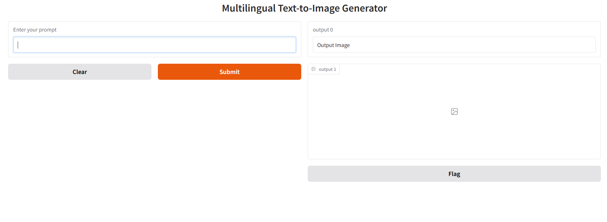
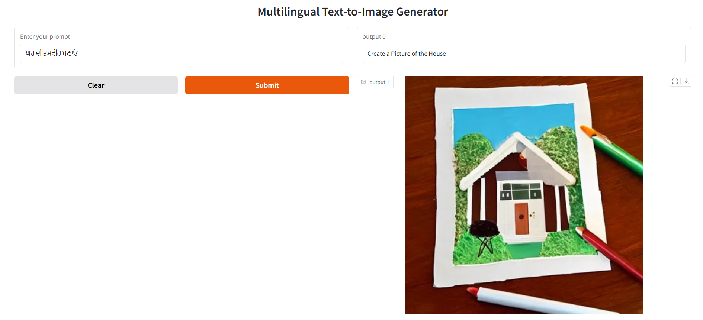

## Overview: 
This project is a multi lingual image generation tool that lets users describe any object or scene in Hindi, English, Punjabi, or Spanish. The system automatically detects
the input language, translates the prompt to English, and then generates an image based on the translated prompt using Stable Diffusion.

## Features:
1. **Multilingual Support** - Accepts prompts in Hindi, English, Punjabi or Spanish.
2. **Language Detection** - Uses langdetect to automatically identify the input language.
3. **On-the-Fly Translation** - Uses Hugging Facce MarianMT models to translate non-English input prompt to English.
4. **Image Generation** - Uses runwayml/stable-diffusion-v1-5 to generate high quality images.
5. **User-Friendly Web Interface** - Built with Gradio for quick and easy interaction.

## How It Works:
1. **User Input:** User enters a prompt in one of the supported languages.
2. **Language Detection:** The system detects the language using langdetect.
3. **Translation:** If the prompt is not in English, it is translated to English using a MarianMT model.
4. **Image Generation:** The (translated) English prompt is passed to the Stable Diffusion model to generate the image.
5. **Display:** Both the English prompt and the generated image are shown on the Gradio interface.

## Project Structure:

| File                | Description                                                  |
| ------------------- | ------------------------------------------------------------ |
| `translation.py`    | Detects language and translates prompt to English.           |
| `generate_image.py` | Loads and runs the Stable Diffusion image generator.         |
| `frontend.py`       | Provides the Gradio-based web UI to interact with the model. |

## Example
    Input(Hindi): "एक बिल्ली की तस्वीर बनाएं""
    Detected Language: Hindi
    Translated Prompt: "Draw a picture of a cat"
    Generate Image: Image is shown on the Gradion interface.

## Steps to install and run the app:

1. git clone https://github.com/Harry8527/multilingual-image-generator.git
2. cd multilingual-image-generator
3. pip install -r requirements.txt
4. python frontend.py
5. Gradio will launch in your browser at http://127.0.0.1:7860
6. Pass the prompt to generate an image.

## Some snapshots of UI:
Default UI - 
Generated image of a house when the user prompt was in punjabi - 

Check out the configuration reference at https://huggingface.co/docs/hub/spaces-config-reference

